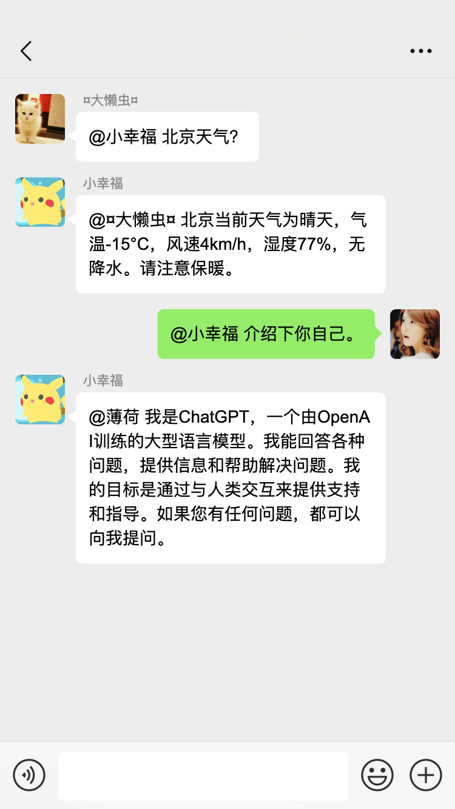

<div align="center">

# chat-E-AI

<p align="center">
  <a href="./README.md">简体中文</a>
</p>

chat-E-AI 是一款创新的即时通讯机器人，具有嵌入人工智能（AI）的特点。它能将AI嵌入你的聊天频道，使你和你朋友更能够像和其他人聊天一样，来获取AI的问答响应。

</div>

<p align="center">
  <a href="#-面向开发者">
    
  </a>
  <a href="#-类似项目">
    
  </a>
  <a href="https://github.com/garinops/chat-E-AI/blob/main/LICENSE">
    
  </a>
</p>

<div align="center">

|                                    |                                    |
| ---------------------------------- | ---------------------------------- |
|  |  |
|  |  |

</div>

## 🛸 项目部署
### 第一步：克隆项目源代码
  ```shell
  git clone https://github.com/garinops/chat-E-AI.git
  ```
  ```shell
  cd chat-E-AI
  ```
### 第二步：安装Python
- **Python3.10或更高。**
- **配置Python venv虚拟环境（可选，强烈建议！）[阅读venv虚拟环境](https://docs.python.org/zh-cn/3/library/venv.html)。**
  - 创建venv虚拟环境，以Python3.10为例。
    ```
    python3.10 -m venv venv-chat-E-AI
    ```
  - 激活venv虚拟环境（Windows）。
    ```
    venv-chat-E-AI\Scripts\activate
    ```
  - 激活venv虚拟环境（Linux\Unix\MacOS）。
    ```
    source venv-chat-E-AI/bin/activate
    ```
- **安装chat-E-AI项目依赖**
  ```shell
  pip install -r requirements.txt  -i https://pypi.tuna.tsinghua.edu.cn/simple
  ```
### 第三步：编辑配置文件，以嵌入OpenAI为例：
- **编辑config/setting.py，设置OpenAI API Key（最小配置）**
  ```python
  OPENAI_API_KEY = "你的Key"
  ```
- **其他根据需要配置，参阅setting.py的注释说明（可选）**

### 第四步：运行项目，开始和AI进行第一次对话，以接入个人微信为例：
- **运行程序**
  ```
  python main.py
  ```
- **在终端，使用微信扫描终端上的二维码，登录微信。**
- **给文件助手发送信息，或让你的朋友给你发送以"AI"开头的任何问题，等待回复。**
  > 注：以"AI"为暗号为默认配置，你可以在setting.py中设置为任何字符串。甚至为空（如果暗号为空，私聊、群聊的任何问题都会获得回复，不包括自己发送的）。
### 第五步：配置后台运行、开机启动。（可选）
- **以使用systemctl系统管理程序的Linux系统ubuntu为例：**
  - 创建系统管理服务配置
  ```shell
  sudo nano /lib/systemd/system/chat-E-AI.service
  ```
  - ***配置示例***
  ```config
  [Unit]
  Description=Daemon for chat-E-AI Demo Application
  After=network.target

  [Service]
  User=ubuntu
  Group=ubuntu
  
  WorkingDirectory=/home/ubuntu/chat-E-AI/
  ExecStart=/home/ubuntu/chat-E-AI/venv-chat-E-AI/bin/python main.py

  [Install]
  WantedBy=multi-user.target
  ```
  - 生效配置
  ```shell
  sudo systemctl daemon-reload
  ```
  - 运行chat-E-AI服务
  ```shell
  sudo systemctl start chat-E-AI.service
  ```
  - 登录
  ```shell
  journalctl -u chat-E-AI.service -n 50
  ```
  - 检查chat-E-AI服务运行状态
  ```shell
  sudo systemctl status chat-E-AI.service
  ```
  - ***配置开机启动（如果需要）***
  ```shell
  sudo systemctl status chat-E-AI.service
  ```
  


<a href="#readme">
    
</a>

## 💡 功能

`1` 即时通讯支持
   - [x] 个人微信 - 基于itchat
   - [ ] 企业微信
   - [ ] 微信公众号
   - [ ] 钉钉
   - [ ] 飞书

`2` AI支持
   - [x] OpenAI
   - [ ] 文心一言
   - [ ] 讯飞星火
  
`3` OpenAI
   - [x] 文本完成
   - [x] tools-天气联网 - 基于wttr.in
   - [x] tools-宏微观经济数据库 - 基于嘉林数据 
   - [x] tools-时间 - 基于本地
   - [ ] 图片生成
   - [ ] 语音翻译
   - [ ] 语音生成

<a href="#readme">
    
</a>

## 👨‍💻 面向开发者

- **嵌入其他AI**
- **嵌入其他即时通讯**
- **OpenAI tools开发**
  > 通过OpenAI的工具函数功能（tools），开发者能进一步拓展GPT的能力，比如联网获取实时信息，与第三方应用互动等。
  - 参照"./AIs/OpenAI/tools/TIME.py"这个时间工具，你可以轻松开发其他插件。
  - tools工具已经在项目实现集成，你不必处理其他细节，只需要专注定义自己的插件工具，以及你的API调用即可。
  - 注意开发规范。
- **OpenAI 模型添加**
  > 项目已OpenAI几个常用封装模型为字典，可贡献补充其他模型。
  - 编辑/chat-E-AI/AIs/OpenAI/Model_Dicts.py
  - 按Model_Dicts.py的文档规范贡献补充其他模型。
  

<a href="#readme">
    
</a>

## 🏘️ 社区交流群

添加 wx 小助手加入：


<a href="#readme">
    
</a>

## 💪 类似项目

- [chatgpt-on-wechat](https://github.com/zhayujie/chatgpt-on-wechat)


<a href="#readme">
    
</a>

[//]: # (## 👀 其他)

[//]: # (## 🌿 第三方生态)

## 🤝 参与贡献

我们非常欢迎各种形式的贡献。如果你对贡献代码感兴趣，可以大展身手，向项目贡献你的伟大能力。

<a href="https://github.com/garinops/chat-E-AI/graphs/contributors" target="_blank">
  <table>
    <tr>
      <th colspan="2">
        <br><br><br>
      </th>
    </tr>
    <tr>
      <td>
        <picture>
          <source media="(prefers-color-scheme: dark)" srcset="https://next.ossinsight.io/widgets/official/compose-org-active-contributors/thumbnail.png?activity=active&period=past_28_days&owner_id=86670875&repo_ids=732435359&image_size=2x3&color_scheme=dark">
          
        </picture>
      </td>
      <td rowspan="2">
        <picture>
          <source media="(prefers-color-scheme: dark)" srcset="https://next.ossinsight.io/widgets/official/compose-org-participants-growth/thumbnail.png?activity=new&period=past_28_days&owner_id=86670875&repo_ids=732435359&image_size=4x7&color_scheme=dark">
          
        </picture>
      </td>
    </tr>
    <tr>
      <td>
        <picture>
          <source media="(prefers-color-scheme: dark)" srcset="https://next.ossinsight.io/widgets/official/compose-org-active-contributors/thumbnail.png?activity=new&period=past_28_days&owner_id=86670875&repo_ids=605673387&image_size=2x3&color_scheme=dark">
          
        </picture>
      </td>
    </tr>
  </table>
</a>

<a href="#readme">
    
</a>

## 🌟 Star History

<a href="https://github.com/garinops/chat-E-AI/stargazers" target="_blank" style="display: block" align="center">
  <picture>
    <source media="(prefers-color-scheme: dark)" srcset="https://next.ossinsight.io/widgets/official/analyze-repo-stars-history/thumbnail.png?repo_id=732435359&image_size=auto&color_scheme=dark">
    
  </picture>
</a>

<a href="#readme">
    
</a>

## 使用协议

本仓库遵循 [MIT License](./LICENSE)  开源协议。